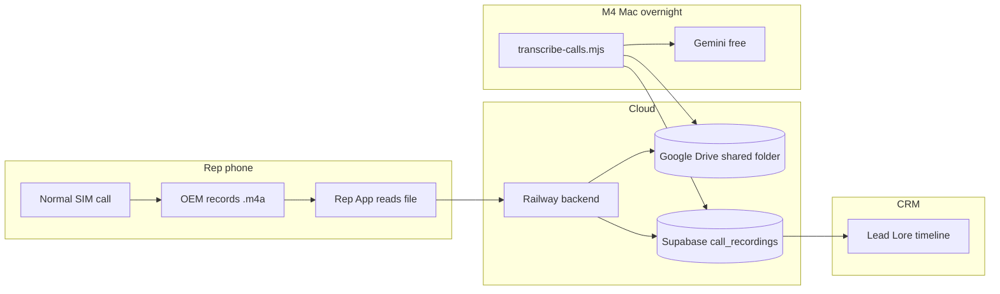

# Call recordings — shared Google account flow

> One clinic Google account · all rep recordings in one Drive folder · M4 transcribes overnight · Lore shows transcript.

## Architecture



**Reps do NOT log into Google on phone.** App sends audio to Railway → Railway uploads to **your** shared Drive using a service account.

---

## What you set up once

### 1 · Clinic Google account

Create or use one account, e.g. `relivecure.recordings@gmail.com`.

In Drive, create folder: **Relive Cure Call Recordings**  
Copy the **folder ID** from the URL: `https://drive.google.com/drive/folders/FOLDER_ID_HERE`

### 2 · Google Cloud service account

1. [Google Cloud Console](https://console.cloud.google.com) → new project → enable **Google Drive API**
2. IAM → Service Accounts → Create → download JSON key
3. Open the JSON → copy `client_email` (looks like `xxx@xxx.iam.gserviceaccount.com`)
4. In Drive, **Share** the folder with that email → **Editor**

### 3 · Railway env vars

```
GOOGLE_SERVICE_ACCOUNT_JSON={"type":"service_account",... entire json on one line ...}
GOOGLE_DRIVE_FOLDER_ID=your_folder_id
```

Until these are set, recordings still work via Supabase Storage (fallback).

### 4 · M4 env (same keys + Supabase)

Add to `~/.zshrc` or cron:

```
export GEMINI_API_KEY=...
export SUPABASE_URL=...
export SUPABASE_SERVICE_ROLE_KEY=...
export GOOGLE_SERVICE_ACCOUNT_JSON='...'
export GOOGLE_DRIVE_FOLDER_ID=...
export CRM_API_KEY=...
export BACKEND_URL=https://relive-cure-backend-production.up.railway.app
```

Nightly:

```bash
node server/scripts/transcribe-calls.mjs
```

Cron example (2:30am):

```
30 2 * * * cd ~/Documents/relive-cure-workspace/relive-cure-backend && source ~/.relivecure-env && node server/scripts/transcribe-calls.mjs >> ~/ReliveCure/logs/transcribe.log 2>&1
```

---

## Per-rep setup (no Google login on phone)

1. Install Rep App v0.3+
2. Sign in with CRM key + rep name
3. Enable **Record calls → All calls** on phone
4. CRM → **Settings → Rep phones** → set recording folder path
5. Make test call → file lands in Drive folder → M4 script → Lore shows transcript

Optional: set **Google account** field in dashboard to `relivecure.recordings@gmail.com` for your records (informational only — upload uses service account).

---

## Status in CRM

| Rep phones panel | Meaning |
|------------------|---------|
| Setup complete | Path OK + upload working |
| Upload to: drive | Using shared Google folder |
| Last upload | Recording reached cloud |

| call_recordings.transcript_status | Meaning |
|-----------------------------------|---------|
| pending | Waiting for M4 transcribe script |
| done | In Lore as call_transcribed |
| failed | Retry or check Gemini/Drive |

---

## Cost

| Piece | Cost |
|-------|------|
| Google Drive (15GB free / Workspace) | ₹0–₹136/user/mo if Workspace |
| Gemini transcription | Free tier |
| Railway | ₹500/mo existing |
| M4 overnight | ₹0 |

---

## Not needed

- Reps logging into Google on each phone
- Separate Drive per rep (one folder, filenames include rep name + phone)
- Play Store for this flow to work
